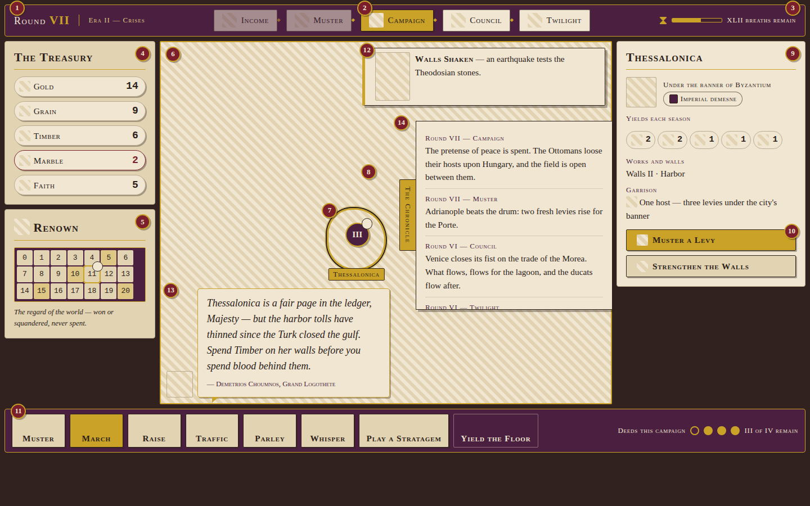

# IMPERIUM — Twilight of Empires

*A browser grand-strategy board game for the last age of the Roman world.*

It is the year 1400, and the Queen of Cities is a shrunken jewel ringed by the
rising crescent. Byzantium, the Ottomans, Venice, Genoa and Hungary — five
powers, each with its own economy, war machine and secret ambitions — contend
for Prestige across sixteen rounds as the clock runs down to 1453 and the fate
of Constantinople. 2–5 players, in the browser.



## Quick start

Requires Node.js ≥ 20 and npm ≥ 10.

```bash
npm install
npm run dev
```

This builds the shared package, then starts the server on
<http://localhost:8080> and the Vite client on <http://localhost:5173>.
Open the client in two browser tabs: in the first, **Create Game** and note the
six-character room code; in the second, **Join Game** with that code. The host
starts the game once everyone has picked a faction.

## How to play

- Each round is a year-cluster of the century: **Income → Muster → Campaign →
  Council → Twilight**, sixteen rounds from 1400 to 1453.
- Provinces are resource tiles (gold, grain, timber, marble, faith) you tax
  each Income phase — spend them on levies, fleets, walls and great works.
- Campaigns are fought with armies, fleets and modified dice; the Council is
  where alliances, tribute and betrayal happen.
- Victory goes to the highest **Prestige** once someone passes the era
  threshold (scaled ~72/75/80/78 by player count), or the highest Prestige when
  Round 16 ends — or, in sudden death, to whoever captures Constantinople and
  holds it through two cleanup rounds.
- Full rules live in [`docs/GAME_DESIGN.md`](docs/GAME_DESIGN.md) (the master
  rulebook), with the map, factions and event cards in its sibling docs under
  [`docs/`](docs/).

## Project map

| Directory  | What lives there                                                    |
| ---------- | ------------------------------------------------------------------- |
| `shared/`  | `@imperium/shared` — game-state types and the Socket.IO wire protocol |
| `server/`  | `@imperium/server` — Express + Socket.IO server, lobby, game engine |
| `client/`  | `@imperium/client` — React + Vite client                            |
| `docs/`    | Design docs: game design, architecture, map, factions, UI           |
| `design/`  | Static HTML/CSS screen mockups and their screenshots                |
| `art/`     | Original SVG illustrations (events, factions, lore)                 |
| `audio/`   | Music and SFX, plus the tools that generate them                    |
| `lore/`    | Narrative text: chronicle entries, events, tutorial, UI copy        |
| `e2e/`     | Playwright end-to-end tests and a socket load harness               |
| `sim/`     | Balance simulation harness — adversarial regression gate and reports |
| `rulebook/`| Illuminated HTML rulebook                                            |
| `deploy/`  | Dockerfiles, compose file, nginx config, Fly.io config              |

## Testing

The unit tests import the built `@imperium/shared` package, so build it once
first (running `npm run dev` or `npm run build` also does this):

```bash
npm run build --workspace @imperium/shared
npm test                        # vitest: server engine + lobby, client socket layer
npm run test:e2e                # Playwright: full two-player lobby flow in Chromium
cd server && node --import tsx scripts/smoke.mjs   # socket smoke test: boots the server, drives a lobby with two clients
```

## Deployment

Docker images, compose setup and Fly.io notes are in
[`deploy/README.md`](deploy/README.md).

## Credits

All art and audio assets are original works created for this project and
dedicated to the public domain under CC0 1.0 — see
[`art/illustrations/CREDITS.md`](art/illustrations/CREDITS.md) and
[`audio/CREDITS.md`](audio/CREDITS.md) (the current audio files are
procedurally generated placeholders).
