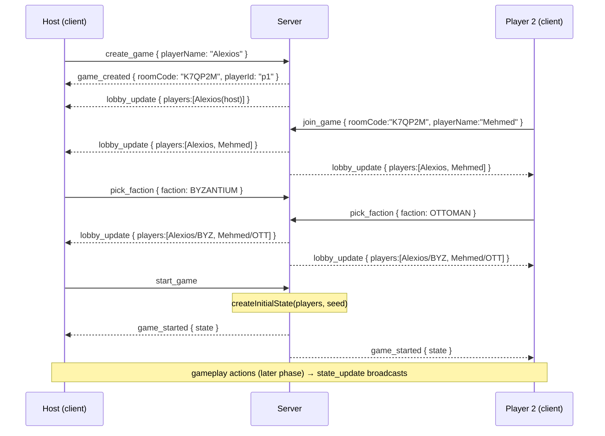

# IMPERIUM: Twilight of Empires — Architecture

> The technical plan for the codebase. This document describes the **actual
> scaffold** in this repository and the shape it grows into. Game rules live in
> [`GAME_DESIGN.md`](./GAME_DESIGN.md); visual language in
> [`UI_DESIGN.md`](./UI_DESIGN.md).

---

## 1. Overview

IMPERIUM is a **server-authoritative**, real-time-lobby, turn-based multiplayer
game. A Node server owns the rules and the single source of truth; browsers are
thin, reactive views connected over WebSockets.

* **Language:** TypeScript everywhere (server, client, shared).
* **Repo shape:** a **monorepo** using **npm workspaces**.
* **Transport:** Socket.IO (WebSocket) for game/lobby events; Express for HTTP.
* **Client:** React + Vite single-page app.
* **Tests:** Vitest, focused on the pure rules engine.

```
War-Game/
├── package.json            # root: npm workspaces [shared, server, client], dev/build/test scripts
├── tsconfig.base.json      # shared strict TS compiler options (ES2022, strict, declaration)
├── shared/                 # @imperium/shared — types + socket protocol (no runtime deps)
│   ├── src/
│   │   ├── types/gameState.ts     # GameState, Province, Player, Army, Fleet, Card, enums…
│   │   ├── protocol/socket.ts     # SOCKET_EVENTS + payload interfaces
│   │   └── index.ts               # re-exports everything
│   └── tsconfig.json       # composite project, emits dist/ .d.ts
├── server/                 # @imperium/server — Express + Socket.IO + rules engine
│   ├── src/
│   │   ├── index.ts               # HTTP + Socket.IO bootstrap (transport)
│   │   ├── engine/                # PURE rules engine (no I/O) — see §4
│   │   └── lobby/lobbyManager.ts  # room lifecycle (join-by-code) — see §6
│   ├── vitest.config.ts    # test include src/**/*.test.ts, node env
│   └── tsconfig.json       # composite, references ../shared
└── client/                 # @imperium/client — React + Vite SPA — see §7
    └── src/                # screens, SVG map, socket hook, styles/tokens.css
```

The three workspaces are wired as **TypeScript composite/project references**:
`server` and `client` both reference `shared`, so a change to a shared type is a
compile-time break on both ends — the wire format can never silently drift.

Root scripts (`package.json`):

| Script | Does |
|---|---|
| `npm run build` | Build shared → server → client, in order |
| `npm run dev` | `concurrently` runs server (`tsx watch`) + client (`vite`) |
| `npm test` | Runs the server's Vitest suite (the engine tests) |
| `npm run typecheck` | `tsc -b` across shared + server + client |

---

## 2. `shared/` — the contract

`@imperium/shared` is a **dependency-free** package of pure types and constants,
imported by both server and client. It is the single definition of the game's
data model and wire protocol. Its two modules:

* `types/gameState.ts` — the game data model (§3).
* `protocol/socket.ts` — the Socket.IO event registry and payload types (§5).

Because it emits `.d.ts` + `.js` and is referenced as a composite project, both
apps consume it as `@imperium/shared` with full type safety.

---

## 3. Data Model

The authoritative types (verbatim from
[`shared/src/types/gameState.ts`](../shared/src/types/gameState.ts)). The whole
game is a single serialisable `GameState` object.

### 3.1 Enums

```ts
enum Faction   { BYZANTIUM, OTTOMAN, VENICE, GENOA, HUNGARY }
enum TerrainType { PLAINS, HILLS, MOUNTAINS, FOREST, COAST, CITY }
enum UnitType  { LEVY, INFANTRY, CAVALRY, ARCHER, SIEGE, GALLEY, WARSHIP }
enum GamePhase { LOBBY, INCOME, RECRUITMENT, MOVEMENT, COMBAT, DIPLOMACY, END }
```

### 3.2 Core interfaces

```ts
/** The five tradeable/consumable resources. Every economic figure is one of these. */
interface ResourceBundle {
  gold: number;
  grain: number;
  timber: number;
  stone: number;   // "stone/marble"
  faith: number;
}

/** A land region: the atomic unit of ownership and income. */
interface Province {
  id: string;
  name: string;
  terrain: TerrainType;
  yields: ResourceBundle;          // per-turn yield
  ownerId: string | null;          // player id, or null = neutral
  coastal: boolean;
  position: { x: number; y: number }; // centroid in 0–100 SVG viewBox space
}

/** A navigable stretch of water connecting coastal provinces. */
interface SeaZone {
  id: string;
  name: string;
  position: { x: number; y: number };
}

/** A stack of land units in a province. */
interface Army {
  id: string;
  ownerId: string;
  locationId: string;              // province id
  units: Record<UnitType, number>;
}

/** A stack of naval units in a sea zone or coastal province. */
interface Fleet {
  id: string;
  ownerId: string;
  locationId: string;              // sea zone id (or coastal province)
  units: Record<UnitType, number>;
}

/** A political/event/tactic card held or played by a player. */
interface Card {
  id: string;
  name: string;
  description: string;
  cost: Partial<ResourceBundle>;
}

/** A seated participant. */
interface Player {
  id: string;
  name: string;
  faction: Faction | null;
  isHost: boolean;
  connected: boolean;              // drives reconnect UI (§8)
  treasury: ResourceBundle;
  hand: Card[];
}

/** The complete, serialisable state of a single game. */
interface GameState {
  roomCode: string;
  phase: GamePhase;
  turn: number;                    // round number, 1..16 (the "year")
  activePlayerIndex: number;       // index into turnOrder
  turnOrder: string[];             // player ids, re-sorted each cleanup by prestige
  players: Player[];
  provinces: Province[];
  seaZones: SeaZone[];
  armies: Army[];
  fleets: Fleet[];
}

const EMPTY_RESOURCES: ResourceBundle = { gold:0, grain:0, timber:0, stone:0, faith:0 };
```

### 3.3 Growth fields (added as systems land)

The scaffold ships the fields above; later phases extend `GameState`/`Player`
with (kept in `shared` so both ends stay typed):

* `Player.prestige: number`, `Player.objectives: Card[]` (secret), `Player.tax`,
  `Player.treaties`, `Player.vassals: string[]`.
* `GameState.omenDeck` / `discard`, `GameState.mercMarket` (bid row, §Game-Design
  §6.3), `GameState.minors` (NPC states), per-province `walls`/`buildings`/`siege`.
* `GameState.log: GameLogEntry[]` — the **structured event log** (§9), present
  from day one.
* `GameState.rngSeed` / `rngCursor` — the seeded-RNG state (§4.2).

---

## 4. Rules Engine (`server/src/engine/`)

The heart of the server. A **pure, deterministic, well-tested** module kept
**strictly separate from transport** (no Socket.IO, no Express, no `Date.now()`,
no `Math.random()` inside it). Everything is a function of explicit inputs.

### 4.1 Module layout

| File | Exports | Responsibility |
|---|---|---|
| `engine/mapData.ts` | `MAP_PROVINCES`, `MAP_SEAZONES`, `ADJACENCY` | Static map definition (from [`MAP.md`](./MAP.md)) |
| `engine/gameState.ts` | `createInitialState(players, seed)` | Build a fresh `GameState` for a started game |
| `engine/income.ts` | `computeIncome(state, playerId)` | Sum province yields + buildings + trade routes → `ResourceBundle` |
| `engine/adjacency.ts` | `areAdjacent(a, b)` | Graph queries over the map (movement/attack legality) |
| `engine/actions.ts` | `applyAction(state, action)` | The reducer: `(state, action) → newState` |
| `engine/rng.ts` | `makeRng(seed)`, `roll(rng, n)` | Seeded deterministic RNG for dice/draws |
| `engine/*.test.ts` | — | Vitest unit tests co-located per module |

### 4.2 Design: `(state, action) → newState`

The engine is a **reducer**. Every mutation to a game flows through one entry
point:

```ts
type GameAction =
  | { type: "RECRUIT";  playerId: string; provinceId: string; units: Partial<Record<UnitType, number>>; mercenary?: boolean }
  | { type: "MOVE";     playerId: string; unitStackId: string; toId: string }
  | { type: "BUILD";    playerId: string; provinceId: string; building: BuildingType }
  | { type: "TRADE";    playerId: string; /* convert | route */ }
  | { type: "DIPLOMACY"; playerId: string; /* propose | accept | vassalize | … */ }
  | { type: "PLAY_CARD"; playerId: string; cardId: string }
  | { type: "SPY";      playerId: string; mission: "OMEN" | "OBJECTIVE" | "UNREST"; targetId?: string }
  | { type: "ADVANCE_PHASE"; /* engine-internal: Omen→Income→…→End */ };

function applyAction(state: GameState, action: GameAction): GameState; // pure, returns a new state
```

Properties:

* **Pure & immutable** — returns a new `GameState`; never mutates the input. Makes
  testing trivial and enables trivial undo/replay/snapshotting.
* **Deterministic** — all randomness (combat dice, Omen draws, revolt/starvation
  checks, spy rolls, merc-market draws) comes from a **seeded RNG** whose seed and
  cursor live *in the state*. Given the same state + action, every machine — and
  the server re-validating a client's optimistic move — produces the identical
  result. This is what makes the game **reproducible and replayable** (and powers
  the end-game chronicle, §9).
* **Validating** — `applyAction` first checks legality (turn, ownership,
  adjacency, resource cost, action budget) and throws/returns an error result on
  an illegal action; the transport turns that into an `error_msg` (§5).

### 4.3 Why server-authoritative

* **Anti-cheat** — clients never compute outcomes that matter; they *request*
  actions. The server holds the deck order, the RNG seed, hidden objectives, and
  fog-of-war, and only broadcasts what each client is allowed to see. A tampered
  client cannot forge a dice result or peek at a secret objective.
* **Single source of truth** — one `GameState` per room on the server; clients are
  pure projections of `state_update`. No client-side reconciliation of divergent
  states, no authority disputes.
* **Determinism as validation** — because the engine is pure and seeded, the
  server can re-run any action to confirm it, and any disconnect/replay
  reconstructs the exact game from `(initialState, actions[])`.

The transport layer (`server/src/index.ts`) is a thin adapter: receive socket
event → build `GameAction` → `applyAction` → persist new state in the room →
broadcast `state_update`. It contains **no rules**.

---

## 5. WebSocket Protocol

Defined once in
[`shared/src/protocol/socket.ts`](../shared/src/protocol/socket.ts) as
`SOCKET_EVENTS` plus payload interfaces, and typed into Socket.IO via
`ClientToServerEvents` / `ServerToClientEvents`. Event names are string constants
so client and server can never disagree on the wire.

### 5.1 Client → Server

| Event (`SOCKET_EVENTS.*`) | Wire name | Payload | Meaning |
|---|---|---|---|
| `CREATE_GAME` | `create_game` | `{ playerName: string }` | Create a new room; caller becomes host |
| `JOIN_GAME` | `join_game` | `{ roomCode: string; playerName: string }` | Join an existing room by 6-char code |
| `PICK_FACTION` | `pick_faction` | `{ faction: Faction }` | Claim an unclaimed faction in the lobby |
| `START_GAME` | `start_game` | *(none)* | Host starts the game (builds initial state) |
| `LEAVE_GAME` | `leave_game` | *(none)* | Leave the room / lobby |

> **In-game action messages come later.** The scaffold covers lobby/setup only.
> A follow-up phase adds gameplay events (e.g. `game_action` carrying the
> `GameAction` union of §4.2 — `recruit` / `move` / `build` / `trade` /
> `diplomacy` / `play_card` / `spy`), all validated by the same engine reducer.

### 5.2 Server → Client

| Event (`SOCKET_EVENTS.*`) | Wire name | Payload | Meaning |
|---|---|---|---|
| `GAME_CREATED` | `game_created` | `{ roomCode: string; playerId: string }` | Ack of create; gives caller its room code + player id |
| `LOBBY_UPDATE` | `lobby_update` | `{ roomCode, players: LobbyPlayer[], startedByHost }` | Roster changed (join/leave/faction pick) |
| `GAME_STARTED` | `game_started` | `{ state: GameState }` | Game began; full initial state |
| `STATE_UPDATE` | `state_update` | `{ state: GameState }` | Authoritative state after any change |
| `ERROR_MSG` | `error_msg` | `{ message: string }` | A request was rejected (bad code, illegal action, room full…) |

Where `LobbyPlayer = { id, name, faction: Faction | null, isHost }`.

```ts
// Both sides parameterise Socket.IO with these, so payloads are checked at compile time:
Server<ClientToServerEvents, ServerToClientEvents>
```

### 5.3 Fog of war

Because the server is authoritative it can send **per-player projections** of
`GameState` (hiding other players' hands, secret objectives, and unseen
provinces) rather than the raw object. The scaffold sends the full state; the
projection filter is a server-side transform added alongside gameplay events.

---

## 6. Lobby / Join-by-Code Flow

`server/src/lobby/lobbyManager.ts` owns room lifecycle, independent of the rules
engine.

* **Create** → generate a **6-character uppercase alphanumeric room code** (e.g.
  `K7QP2M`), create a room, seat the creator as **host**, reply `game_created`.
* **Join** → up to **5 players** join a room by code + name; each join broadcasts
  `lobby_update` to the room. Rejections (`error_msg`): unknown code, room full,
  game already started.
* **Pick faction** → a player claims one of the five unclaimed `Faction`s;
  broadcast `lobby_update`.
* **Start** → **host only**; requires ≥ 2 players, each with a faction. The server
  calls `createInitialState(players, seed)` and broadcasts `game_started`.

Room codes map `roomCode → Room { players, socketIds, gameState | null, seed }`.

### 6.1 Sequence diagram



---

## 7. `client/` — React + Vite SPA

The browser app. React function components + hooks, Vite dev/build,
`socket.io-client` for transport, a hand-authored **SVG map** component, and CSS
custom properties + Google Fonts (**Cinzel** + **EB Garamond**) per
[`UI_DESIGN.md`](./UI_DESIGN.md).

* **Socket layer** — a `useSocket()` hook wraps a single `socket.io-client`
  connection typed with the shared `ClientToServerEvents`/`ServerToClientEvents`;
  a `GameContext` holds the latest `GameState` from `state_update`/`game_started`
  and re-renders the tree.
* **Screen flow** — `Home → Create/Join → Faction Pick → Lobby → Game Board`
  (a router or a `screen` state machine keyed off connection/game phase). The
  **Game Board** is a **placeholder** in the scaffold: it renders the SVG map,
  resource bar, and panels from `GameState`, but in-game actions are stubbed until
  the action engine lands.
* **SVG map** — provinces/sea zones positioned by their `position` (0–100 viewBox
  space) with the interaction states of `UI_DESIGN.md` §6; ownership washes use
  the per-faction color **+ pattern** for colorblind safety (`UI_DESIGN.md` §7).
* **Styling** — `src/styles/tokens.css` defines the palette/type tokens
  (`--imp-*`, `--font-*`); fonts loaded in `index.html`.

---

## 8. Reconnect Handling

Networked play must survive refreshes and drops.

* **playerId persistence** — on `game_created`/join, the client stores its
  `playerId` (and `roomCode`) in `localStorage`. A `Player` also carries a
  `connected` flag so the UI can grey out dropped powers.
* **Rejoin** — on reconnect the client re-emits a join carrying its stored
  `playerId` (a `rejoin_game { roomCode, playerId }` event added alongside
  gameplay; in the scaffold, `join_game` by name into an existing seat). The
  lobby manager rebinds the new `socketId` to the existing `Player` instead of
  seating a new one, flips `connected = true`, and **re-sends the current state**
  (`state_update` mid-game, or `lobby_update` if still in lobby) so the client
  rebuilds its view exactly.
* **Grace window** — a disconnected player's seat is held (marked
  `connected:false`); their turn is governed by the per-turn timer (§10). The host
  may fill or drop the seat after the grace window.
* **Server as truth** — because state is fully server-side and serialisable, a
  reconnecting client needs no local history: one `state_update` fully rehydrates
  it.

---

## 9. Structured Event Log & End-of-Game Chronicle

From **day one** the engine records a **structured event log**, not just UI text.
Every meaningful state change appends a `GameLogEntry`; the log lives on the state
(`GameState.log`) and is produced only inside the pure engine (so it is
deterministic and replayable). Two things consume it: the live **log/event feed**
(`UI_DESIGN.md` §8.6) and, at game end, the **narrated chronicle**.

### 9.1 `GameLogEntry` format

```ts
type GameLogType =
  | "phase"          // phase/round transitions (e.g., "The year 1444 opens")
  | "event_card"     // an Omen was drawn/resolved
  | "recruit"
  | "trade"
  | "battle"         // field/naval battle result
  | "siege"          // siege progress: bombardment, breach, assault, relief
  | "diplomacy"      // treaty proposed/accepted/renounced, vassalize
  | "betrayal"       // treaty broken (feeds prestige penalty + chronicle drama)
  | "spy"            // espionage attempt/outcome
  | "prestige_change"// any prestige delta, with reason
  | "mercenary"      // merc-market bids & hires
  | "victory";       // threshold hit / sudden death / 1453 endgame

interface GameLogEntry {
  id: string;                 // stable id
  round: number;              // the "year" (1..16 → 1400..1453)
  phase: GamePhase;           // when it happened
  type: GameLogType;
  actors: string[];           // player ids (and/or minor-state ids) initiating
  targets: string[];          // player ids / province ids / sea-zone ids affected
  data: Record<string, unknown>; // typed per `type`: dice rolls, casualties, HP, amounts, seed cursor…
  message: string;            // pre-rendered human-readable line for the live feed
  timestamp: number;          // logical order (monotonic counter, not wall-clock — keeps engine pure)
}
```

`data` carries the machine-readable specifics per type — e.g. a `battle` entry
records attacker/defender composition, each round's rolls, modifiers applied, and
final casualties; a `prestige_change` records `{ delta, reason, newTotal }`. The
`message` is the parchment-line the log feed shows immediately.

### 9.2 End-of-game chronicle

When the game ends (§13 of `GAME_DESIGN.md` — threshold, 1453, or the sudden-death
Fall of Constantinople), the server runs a **chronicle builder** over the full
`GameState.log`: it selects the turning points (decisive battles, the fall/relief
of key cities, betrayals, completed great works, prestige swings, the victor) and
emits a narrated **"history book"** recap — an ordered set of illuminated pages.
The client renders it as the manuscript **Chronicle screen** (`UI_DESIGN.md`
§8.5). Because the log is structured and deterministic, the same chronicle can be
regenerated from a saved game, and later shared or exported. (Server payload for
this — e.g. `game_over { chronicle }` — is added with the endgame phase.)

---

## 10. Per-Turn Timers (online play)

To keep online sessions inside the 60–120-minute target and prevent a
disconnected or idle player from stalling the table, the server enforces a
**per-player action-phase time budget**.

* **Budget** — each player gets a configurable **action-phase clock** (default
  **90 seconds** per action phase, host-adjustable at lobby: e.g. 45s "blitz" /
  90s "standard" / 180s "relaxed", or **off** for hot-seat/casual). The clock runs
  only during that player's slice of the Action phase (`GAMEPHASE` RECRUITMENT→
  MOVEMENT→DIPLOMACY for the active player).
* **Ownership** — the **server owns the clock** (it holds authoritative time);
  clients render a countdown from a `turn_timer { playerId, deadline }` tick. The
  engine stays pure — timing lives in the transport layer, and any timeout is
  converted into a normal engine action so determinism/replay are preserved.
* **Timeout behavior** — when a player's clock hits zero, the server auto-resolves
  their remaining actions as **pass/hold**: unspent actions are forfeited, no
  moves/attacks are issued, mercenary bids default to **pass**, and play advances
  to the next player. A timeout is logged as a `phase`/`prestige_change`-neutral
  `GameLogEntry` so the chronicle can note "the council sat idle."
* **Disconnect interaction** — a `connected:false` player (§8) is timed normally;
  if they reconnect before the deadline they resume with the remaining clock. Two
  consecutive full timeouts flag the seat for host action (fill/drop).
* **Pauses** — the host may **pause** the game (halts all clocks) between phases;
  useful for real tables. Battle/diplomacy modals may grant a small **time
  extension** to the involved players so a war isn't lost to the clock.

---

## 11. Testing

* **Framework** — **Vitest** (`server/vitest.config.ts`: node env,
  `src/**/*.test.ts`, `globals:false` so tests import from `vitest`).
* **What's tested** — the **pure engine**: `computeIncome` yields, `areAdjacent`
  graph correctness, `createInitialState` invariants, and (as they land) the
  `applyAction` reducer paths — combat determinism given a fixed seed, starvation,
  siege HP math, prestige scoring. Purity makes these fast, isolated unit tests
  with no mocks.
* **Determinism tests** — a battle/Omen given a fixed `rngSeed` must produce a
  fixed, asserted `GameLogEntry` — the property that underpins anti-cheat and the
  chronicle.
* **Run** — `npm test` (root) → `vitest run` in `server`.

---

## Operations

The server implements the production ops contract in `deploy/OPERATIONS.md`
(that file is canonical; this is the summary). All of it lives in the
transport layer (`server/src/index.ts` + `server/src/log.ts`) — the engine and
lobby stay pure.

* **Health** — `GET /healthz` → `200`
  `{"status":"ok","rooms":<int>,"uptime":<seconds>}`. Cheap O(1) reads only
  (`rooms` is the live room count, `uptime` is seconds since process start);
  no auth, same port as everything else.
* **Environment variables** (defaults live in code; unknown vars are ignored):

  | Name | Default | Meaning |
  |---|---|---|
  | `PORT` | `8080` | HTTP + socket.io listen port; the server binds `0.0.0.0`. |
  | `CORS_ORIGIN` | *(unset)* | Comma-separated allowed origins, applied to **both** the Express CORS middleware and the socket.io `cors` config. Unset ⇒ deny cross-origin in production, `http://localhost:5173` (the Vite dev client) otherwise. |
  | `ROOM_TTL_SECONDS` | `3600` | Rooms empty (0 connected players) for longer than this are reaped. `LobbyManager` owns the eligibility logic (injectable clock, tested); `index.ts` runs the periodic sweep and logs `room_reaped`. |
  | `LOG_LEVEL` | `info` | Minimum log level emitted (`debug`\|`info`\|`warn`\|`error`). |

* **Graceful shutdown** — on SIGTERM (and SIGINT, identically): (1) stop
  accepting new rooms — `create_game` is refused with an `error_msg`
  ("Server restarting, retry shortly."); (2) broadcast `server_shutdown`
  `{ reconnectAfterMs }` to all connected sockets (event + payload live in
  `shared/src/protocol/socket.ts`); (3) drain up to **20s** — close as soon as
  every socket disconnects, else force at the deadline; (4) close socket.io +
  HTTP and `process.exit(0)`. Room state is in-memory, so a restart still ends
  live games — the shutdown makes that orderly, not survivable.
* **Logging** — single-line JSON to stdout, one object per line:
  `{ts, level, roomCode?, event, msg}` (extra context keys may follow).
  Emitted by the tiny logger in `server/src/log.ts` for server start, room
  create/join/leave, game start, room reaping, and each shutdown phase — e.g.

  ```json
  {"ts":"2026-07-11T14:02:11.412Z","level":"info","roomCode":"K7QF2X","event":"room_created","msg":"room created by Basil (2-5 players)"}
  ```

---

## 12. Roadmap / Next Phases

**Now (scaffold):**

* ✅ Monorepo, workspaces, strict TS, composite project references.
* ✅ Shared data model (`GameState` & friends) + socket protocol constants/types.
* ✅ Server bootstrap (Express + Socket.IO), lobby manager (join-by-code), engine
  skeleton (`mapData`, `createInitialState`, `computeIncome`, `areAdjacent`).
* ✅ Client screen flow → placeholder Game Board rendering state; palette/fonts.
* ✅ `GameLogEntry` structure reserved from day one (§9).

**Next:**

1. **Full map data** — all 48–56 provinces + ~12 sea zones + adjacency + starting
   ownership from [`MAP.md`](./MAP.md); NPC minor states.
2. **In-game action engine** — the `applyAction` reducer for recruit/move/build/
   trade/diplomacy/play-card/spy, the action budget, and the `game_action` socket
   event + per-player state projection (fog of war).
3. **Combat & siege resolution** — seeded dice engine, tactic cards, terrain/wall
   modifiers, multi-turn sieges, naval battles & blockades.
4. **Economy & cards** — taxation, markets/trade routes, the Omen deck &
   `EVENT_CARDS.md` content, the mercenary bid market, prestige scoring & victory.
5. **Per-turn timers & chronicle** — the timer service (§10) and end-of-game
   chronicle builder + `game_over` payload and Chronicle screen.
6. **Persistence / DB** — durable game storage (e.g. Postgres/Redis) for
   long-running games, crash recovery, and true reconnect across server restarts;
   game replays from `(initialState, actions[])`.
7. **Spectators** — read-only sockets receiving fog-free `state_update`s.
8. **Polish** — AI/bots for empty seats, matchmaking, and accessibility passes.

---

*See also:* [`GAME_DESIGN.md`](./GAME_DESIGN.md) · [`UI_DESIGN.md`](./UI_DESIGN.md)
· [`MAP.md`](./MAP.md) · [`FACTIONS.md`](./FACTIONS.md) ·
[`EVENT_CARDS.md`](./EVENT_CARDS.md)
